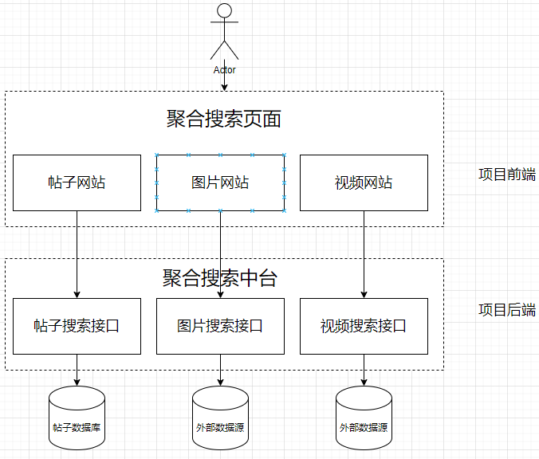

## 项目简介
基于Vue3 + Spring Boot + Elastic Stack 的一站式聚合搜索平台，简易版企业级搜索中台。

>项目后端地址：https://github.com/JaderSun/yuer-search-backend 
> 
> 项目前端地址：https://github.com/JaderSun/yuer-search-frontend

## 项目架构

## 技术栈
### 前端

- Vue3
- Ant Design Vue 组件库
### 后端  

- Spring Boot 2.7 框架
- MySQL 5.7
- Elastic Stack
    -  Elasticsearch 7.17.22
    -  Kibana 7.17.22
    -  Logstash 7.17.22
- 数据抓取
  -  离线 => Hutool HttpClient 抓取数据存到本地数据库
  - 实时 => jsoup 抓取前端html页面实时解析
- 数据同步（4中同步方式）
    - 定时
    - 双写
    - Logstash
    - Canal
- JMeter压力测试
